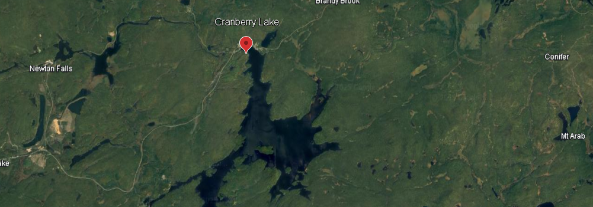
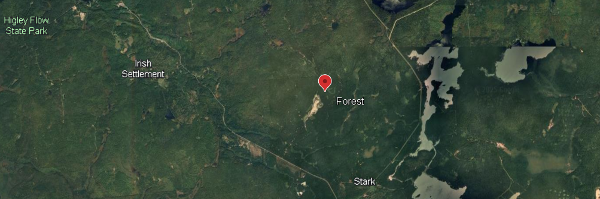
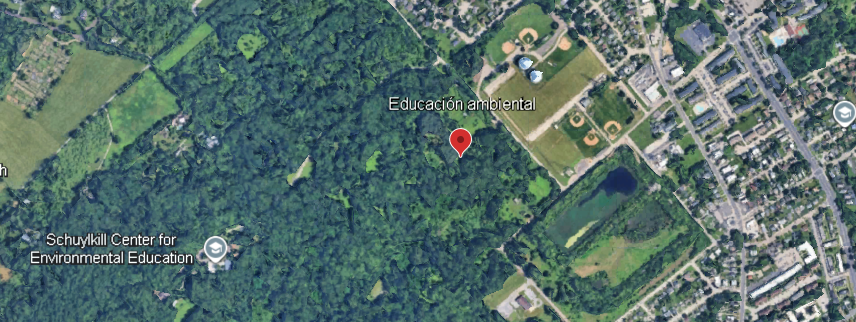

```{r librerias, echo=FALSE, warning=FALSE, message=FALSE}
#Cargamos las librerias que vamos a utilizar en el trabajo
library(dplyr)
library(ggplot2)
library(stringr)
library(sf)
library(rnaturalearth)
library(kableExtra)#Esta la incluimos para las tablas
datos <- read.csv("Data.csv")
Location <- read.csv("Location.csv") 
```

```{r setup, include=FALSE}
knitr::opts_chunk$set(
  echo = TRUE,
  fig.align = "center",
  out.width = "100%",
  fig.cap = "Figura generada a partir de código"
  )

options(knitr.kable.NA = "")

# Aquí hemos establecido las funciones gererales del trabajo, como las características comunes que deben tener las figuras generadas por código y como el código debe verse en todos los chunks a no ser que se marque lo contrario
```

# Introducción

El uso de cámaras trampa es una herramienta esencial para estudiar fauna silvestre, especialmente en especies de **micromamíferos de pequeño tamaño**, donde los métodos tradicionales, como la realización de transectos, suele fallar.

Sin embargo, las cámaras trampa comerciales presentan **limitaciones** relacionadas con la **sensibilidad**, la **latencia** y la **calidad** de las detecciones.

En este estudio, @klemens2021camera aborda estas limitaciones mediante el diseño de un sistema de cámara trampa basado en **detección de movimiento**, con **baja latencia y alta relación señal-ruido**, construyendo un dispositivo con componentes **económicos**, que permitió el registro de micromamíferos nocturnos, como especies de ardillas del género *Glaucomys*, llegando a superar los avistamientos de las cámaras trampas comerciales.

En este proyecto se utiliza el dataset asociado al artículo de @klemens2021camera con el objetivo de explorar patrones de actividad y comportamiento detectados por este tipo de sistema, evaluando la calidad y utilidad de los datos para estudios ecológicos.

## Mapa de las cámaras

#Representacion del mapa

```{r}
head(Location)
```

Los puntos de muestreo se localizan en distintas zonas del estado de Nueva York (USA). Colocandose cámaras en 4 zonas diferentes, dos en urbano y dos en natural, llegando a tener los datos una extensión de casi 500 m^2^ en natural y de 16000 m^2^ en urbano.

Ubicaciones de colocación de las cámaras: {width="100%"}

{width="100%"}

{width="100%"}

{width="100%"}

## Procesado de datos

```{r}
#Con mutate altero unas variables para que sea más facil de comprender el dataset, en este caso creo la  columna ambiente, que hace referencia a 4 localizaciones donde se han colocado las cámaras y les añado la etiqueta natural o urbano, en función de donde estén.

datos <- datos %>% 
  mutate(Ambiente = as.factor(ifelse(
    Site == "CRAN" | Site == "DIA", "Natural",
    ifelse(Site == "ELL" | Site == "SCHU", "Urbano", 0))))

#Creamos una nueva tabla de datos que recoja la información con la que vamos a plantear las hipótesis

# Esta es para la primera hipótesis
datos_procesados <- datos %>% 
  select( #Con select escojo las columnas de interes
    Cam,
    Site,
    Ambiente,
    Total_captures,
    FlyingSquirrel_captures,
    Other_Mammal_captures,
    Flying_squirrel_detected_yes_or_no)

# Esta es para la segunda hipótesis
datos$Trailcam_model <- as.character(datos$Trailcam_model)

datos_sin_NA <- datos[!is.na(datos$Trailcam_model), ] #Debido a la alta presencia de NA en esta parte de los datos, lo eliminamos para no obtener información errónea.

datos_sin_NA$trailcam_Flying_Squirrel_events <- as.numeric(as.character(datos_sin_NA$trailcam_Flying_Squirrel_events))
```

```{r Tabla, echo=FALSE}
# Creo una variable nueva que sirva como base común para todas las tablas que se puedan generar
tabla_base <- function(tabla, base = "Tabla generada a partir de código") {
  tabla %>% 
    knitr::kable(caption = base) %>% 
    kable_styling(position = "center", full_width = FALSE)
}
  
# Ahora represento la tablas de los datos procesados con los ajustes preestablecidos en la base
tabla_base(head(datos_procesados,10))
```

Hay `r nrow(datos_procesados)` entradas de cámaras.

La siguiente tabla resume las variables principales del estudio:

::: {style="text-align: center;"}
| Variable | Descripción |
|------------------------------------|------------------------------------|
| Ambiente | Si se encuentra en zonas urbanas o naturales |
| Total_captures | El número de capturas de cualquier animal |
| FlyingSquirrel_captures | Capturas únicamente de ardillas |
| Other_Mammal_captures | Capturas de todos los demas mamímeros que no sean ardillas |
| Trailcam_model | El modelo de cámara que se ha utilizado |
| trailcam_Flying_Squirrel_events | Captura de ardillas según el modelo de la cámara |
:::

# Materiales y métodos

Para realizar los análisis hemos usado R [@base], con las librerias dplyr [@dplyr], stringr [@stringr], sf [@sf] y rnaturalearth[@rnaturalearth]. Para la representación de las gráficas hemos usado ggplot2[@ggplot2] y para la de las tablas hemos usado kableExtra[@kableExtra].

# Hipótesis

Se han planteado dos hipótesis con la información proporcionada por este trabajo de [kaggle](https://www.kaggle.com/datasets/thedevastator/camera-trap-performance-for-nocturnal-mammals).

La primera está relacionada con el número de capturas de ardillas entre las zonas naturales y las urbanas. La hipótesis nula (H~0~) sería que no hay diferencias significativas entre el número total de ardillas capturadas en natural y en urbano. La hipotesis alternativa (H~1~) sería que si hay diferencias entre el número de capturas de ambos.

La segunda hipótesis está relacionada con las cámaras usadas para el fototrampeo, ya que se utilizaron 4 cámaras distintas para obtener la información. La hipótesis nula (H~0~) sería que no hay diferencias significativas entre las diferentes cámaras de fototrampeo, la hipótesis alternativa (H~1~) sería que si hay diferencias dado que unas cámaras son mejores que otras según la información recolectada.

# Análisis

Usamos la función `t.test()` para calcular el valor de p para saber si los resultados obtenidos estan alejados o no de la realidad antes de observar las gráficas y juzgar por nosotros mismos usando ggplot. Para el cálculo de los datos de la segunda hipótesis, como estamos comparando datos categóricos con datos no categóricos, no podemos usar el `t.test()`, en su lugar usamos `kruskal.test()`.

```{r Analisis, warning=FALSE}
#Análisis del total de capturas

##Hipótesis
#H~0~: el ambiente no influye en el total de capturas de las cámaras.
#H~1~: el ambiente influye en el total de capturas de las cámaras.

t_test_total <- t.test(
  Total_captures ~ Ambiente,
  data = datos_procesados)

t_test_total

#Al salir un p valor no significativo mayor que 0.05, se acepta la hipótesis nula, el ambiente no influye en el total de capturas de las cámaras.

#Gráfica capturas totales

#Boxplot
datos_procesados %>% 
  ggplot(aes(y = Total_captures, x = Ambiente, col = Ambiente))+
  geom_boxplot(show.legend = FALSE)+
  theme_minimal()+
  labs(
    x = "Ambiente",
    y = "Capturas totales",
    title = "Comparación entre las capturas totales de cada ambiente"
  )

#Gráfico de barras
datos_procesados %>% 
  ggplot(aes(x = Ambiente, y = Total_captures, fill = Ambiente))+
  geom_col(show.legend = FALSE)+
  theme_minimal()+
  labs(
    x = "Ambiente",
    y = "Capturas totales",
    title = "Comparación entre las capturas totales de cada ambiente"
  )

#Análisis de ardillas

##Hipótesis
#H~0~: el ambiente no influye en el número de capturas de ardillas.
#H~1~: el ambiente influye en el número de capturas de ardillas.

t_test_ardillas <- t.test(
  FlyingSquirrel_captures ~ Ambiente,
  data = datos_procesados)

t_test_ardillas

#Al salir un p valor significativo menor que 0.05, se rechaza la hipótesis nula y se acepta la alternativa, el ambiente influye en el número de capturas de ardillas.

#Gráfica Capturas de ardillas

#Boxplot
datos_procesados %>% 
  ggplot(aes(y = FlyingSquirrel_captures, x = Ambiente, col = Ambiente))+
  geom_boxplot(show.legend = FALSE)+
  theme_minimal()+
  labs(
    x = "Ambiente",
    y = "Capturas totales de ardillas voladoras",
    title = "Comparación entre las capturas de ardillas voladoras en cada ambiente"
  )

#Gráfico de barras
datos_procesados %>% 
  ggplot(aes(x = Ambiente, y = FlyingSquirrel_captures, fill = Ambiente))+
  geom_col(show.legend = FALSE)+
  theme_minimal()+
  labs(
    x = "Ambiente",
    y = "Capturas totales de ardillas voladoras",
    title = "Comparación entre las capturas de ardillas voladoras en cada ambiente"
  )

#Análisis de otros mamíferos

##Hipótesis
#H~0~: el ambiente no influye en el número de capturas de otros mamíferos.
#H~1~: el ambiente influye en el número de capturas de otros mamíferos.

t_test_otrosm <- t.test(
  Other_Mammal_captures ~ Ambiente,
  data = datos_procesados)

t_test_otrosm

#Al salir un p valor significativo menor que 0.05, se rechaza la hipótesis nula y se acepta la alternativa, el ambiente influye en el número de capturas de otros mamíferos.

#Gráficas de otros mamíferos

#Boxplot
datos_procesados %>% 
  ggplot(aes(y = Other_Mammal_captures, x = Ambiente, col = Ambiente))+
  geom_boxplot(show.legend = FALSE)+
  theme_minimal()+
  labs(
    x = "Ambiente",
    y = "Capturas totales de otros mamíferos",
    title = "Comparación entre las capturas de otros mamíferos en cada ambiente"
  )

#Gráfico de barras
datos_procesados %>% 
  ggplot(aes(x = Ambiente, y = Other_Mammal_captures, fill = Ambiente))+
  geom_col(show.legend = FALSE)+
  theme_minimal()+
  labs(
    x = "Ambiente",
    y = "Capturas totales de otros mamíferos",
    title = "Comparación entre las capturas de otros mamíferos en cada ambiente"
  )

## Ahora los gráficos relacionados con la segunda hipótesis
# Gráfico cámaras y ardillas
ggplot(datos_sin_NA, aes(
  y = trailcam_Flying_Squirrel_events,
  x = Trailcam_model
)) +
  geom_boxplot(outlier.shape = NA, fill = "white", color = "black") +
  geom_jitter(height = 0.2, size = 2, alpha = 0.7) +
  labs(
    x = "Modelo de cámara",
    y = "Eventos de ardillas voladoras (trailcam)",
    title = "Eficiencia de detección de ardillas voladoras por modelo de cámara"
  ) +
  theme_minimal()

# Datos estadísticos de la variable de las ardillas voladoras
resumen_flying_squirrel_events <- datos_sin_NA %>%
  group_by(Trailcam_model) %>%
  summarise(
    n = sum(!is.na(trailcam_Flying_Squirrel_events)),
    media = mean(trailcam_Flying_Squirrel_events, na.rm = TRUE),
    mediana = median(trailcam_Flying_Squirrel_events, na.rm = TRUE),
    sd = sd(trailcam_Flying_Squirrel_events, na.rm = TRUE),
    min = min(trailcam_Flying_Squirrel_events, na.rm = TRUE),
    max = max(trailcam_Flying_Squirrel_events, na.rm = TRUE)
  )

resumen_flying_squirrel_events

# Análisis cámaras y ardillas
kruskal_test_ardillas <- kruskal.test(
  trailcam_Flying_Squirrel_events ~ Trailcam_model,
  data = datos_sin_NA
)

kruskal_test_ardillas

# Gráfica otros mamíferos y cámaras
ggplot(datos_sin_NA, aes(
  y = trailcam_Other_Mammal_events,
  x = Trailcam_model
)) +
  geom_boxplot(outlier.shape = NA, fill = "white", color = "black") +
  geom_jitter(height = 0.2, size = 2, alpha = 0.7) +
  labs(
    x = "Modelo de cámara",
    y = "Eventos de otros mamíferos (trailcam)",
    title = "Eficiencia de detección de otros mamíferos por modelo de cámara"
  ) +
  theme_minimal()

#Análisis
resumen_other_mammal_events <- datos_sin_NA %>%
  group_by(Trailcam_model) %>%
  summarise(
    n = sum(!is.na(trailcam_Other_Mammal_events)),
    media = mean(trailcam_Other_Mammal_events, na.rm = TRUE),
    mediana = median(trailcam_Other_Mammal_events, na.rm = TRUE),
    sd = sd(trailcam_Other_Mammal_events, na.rm = TRUE),
    min = min(trailcam_Other_Mammal_events, na.rm = TRUE),
    max = max(trailcam_Other_Mammal_events, na.rm = TRUE)
  )

resumen_other_mammal_events

kruskal_test_mamal <- kruskal.test(
  trailcam_Other_Mammal_events ~ Trailcam_model,
  data = datos_sin_NA
)

kruskal_test_mamal

# Comparación cámaras y otros eventos

ggplot(datos_sin_NA, aes(
  y = trailcam_Other_events,
  x = Trailcam_model
)) +
  geom_boxplot(outlier.shape = NA, fill = "white", color = "black") +
  geom_jitter(height = 0.2, size = 2, alpha = 0.7) +
  labs(
    x = "Modelo de cámara",
    y = "Otros eventos(trailcam)",
    title = "Eficiencia de detección de otros eventos"
  ) +
  theme_minimal()

# Análisis
resumen_other_events <- datos_sin_NA %>%
  group_by(Trailcam_model) %>%
  summarise(
    n = sum(!is.na(trailcam_Other_events)),
    media = mean(trailcam_Other_events, na.rm = TRUE),
    mediana = median(trailcam_Other_events, na.rm = TRUE),
    sd = sd(trailcam_Other_events, na.rm = TRUE),
    min = min(trailcam_Other_events, na.rm = TRUE),
    max = max(trailcam_Other_events, na.rm = TRUE)
  )

resumen_other_events

kruskal_test_other_events <- kruskal.test(
  trailcam_Other_events ~ Trailcam_model,
  data = datos_sin_NA
)

kruskal_test_other_events

```

# Conclusión

La conclusión que no sugiere los análisis para la primera hipótesis es que, el motivo por el que lar ardillas se han desplazado a los medios urbanos debe ser por la habituación al medio urbano, ya sea por mayor cantidad de comida proporcionada por comederos, mayor cantidad de recursos por presencia humana o ausencia de depredadores. Si observamos las dos últimas gráficas, la proporción de otros mamíferos en zonas urbanas es muy baja, así las ardillas evitan competencia por los recursos.

Además, los análisis nos sugieren que, a pesar de haber menos ardillas en el medio natural, hay mayor cantidad de otros mamíferos, llegando a la conclusión de que hay mayor diversidad de mamíferos en el medio natural.

Relacionado con la segunda hipótesis, podemos decir que no hay relacion entre la cámara y el número de ardillas voladoras avistadas, tampoco la hay con la de otros mamíferos observados, por lo que podemos aceptar la hipótesis nula y rechazar la alternativo. A primera vista, no parece que haya relación entre el modelo de cámara usado y el número de capturas.

# Bibliografía
